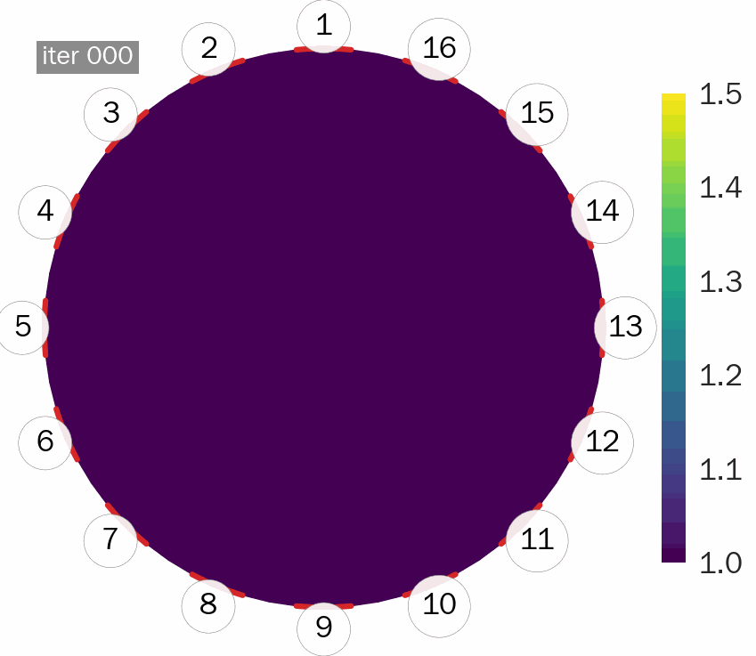
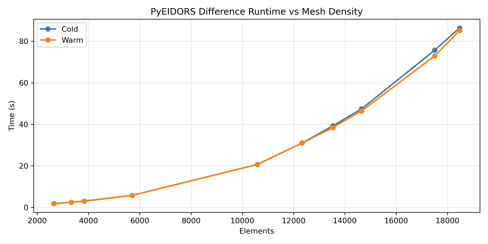
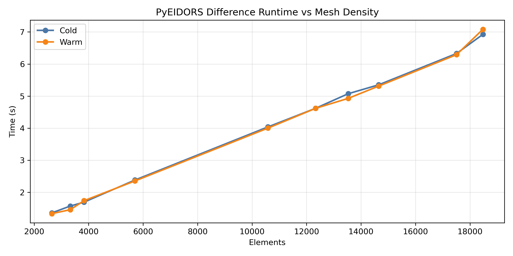

# PyEIDORS

<p align="center">
  
</p>

[](pyproject.toml)


A Python-first EIT framework with a FEniCS Complete Electrode Model (CEM) backend and PyTorch acceleration, designed to be familiar to EIDORS users while enabling modern GPU/differentiable workflows.

SoftwareX manuscript in preparation; citation info will be added after acceptance.

## Why PyEIDORS

- **Numerical consistency** with EIDORS-style workflows (simulation parity + metrics below).
- **Modern architecture**: FEniCS (FEM) + PyTorch (inverse/accel), modular and extensible.
- **End-to-end scripts** for absolute + difference reconstruction with saved outputs under `results/`.

## Gallery (paper figures)

### Modern Architecture: FEniCS + PyTorch

<p align="center">
  
</p>

### Numerical Consistency with EIDORS (Simulation parity)

<p align="center">
  
</p>

*Fig. 3. Simulation parity with legacy toolchains. The subfigures compare conductivity reconstructions and voltage predictions between PyEIDORS and MATLAB/EIDORS to verify numerical consistency. (a) Ground-truth conductivity. (b) PyEIDORS single-step difference reconstruction. (c) MATLAB/EIDORS raw reconstruction in the default coordinate system. (d) EIDORS reconstruction after an affine transformation to align with the Python/NumPy coordinate convention. (e) Differential voltage traces: PyEIDORS and EIDORS predictions compared to the synthetic “measured” voltages.*

### Gauss-Newton Absolute Reconstruction (GIF)

<p align="center">
  
</p>

Absolute-mode voltage RMSE reaches **8.23×10⁻⁸ V**, supporting numerical consistency of the underlying FEM implementation and EIDORS-style reconstruction workflow.

Numerical performance metrics for absolute and difference reconstruction modes (Fig. 4):

| Metric | Absolute mode | Difference mode |
|---|---:|---:|
| RMSE (V) | 8.23×10⁻⁸ | 7.68×10⁻⁵ |
| MAE (V) | 5.59×10⁻⁸ | 6.43×10⁻⁵ |
| Max. absolute error (V) | 2.60×10⁻⁷ | 1.47×10⁻⁴ |
| Pearson correlation | >0.9999 | 0.991 |
| Measurements | 208 | 208 |

### Experimental Validation: Tank Data (Parameter sweep)

<p align="center">
  
</p>

*Fig. 5. Experimental validation of PyEIDORS using tank measurement data. The results verify the software’s ability to accurately reconstruct experimental data and demonstrate consistent numerical performance with MATLAB/EIDORS benchmarks. (a) Experimental setup and inclusion positioning. (b) and (c) Difference reconstructions and boundary voltage sequences generated by PyEIDORS. (d) and (e) Benchmark results from MATLAB/EIDORS after applying an affine transformation for coordinate alignment. (f) and (g) The corresponding original output results directly from MATLAB/EIDORS before transformation.*

Parameter settings for the forward modeling and inverse solution corresponding to Fig. 5(b–e):

| Category | Parameter | b | c | d | e |
|---|---|---:|---:|---:|---:|
| Fwd. | Background conductivity (S/m) | 0.008 | 0.008 | 0.008 | 0.008 |
| Fwd. | Stimulation amplitude | 1.0 | 5e-5 | 1.0 | 5e-5 |
| Fwd. | Measurement gain | 10 | 10 | 10 | 10 |
| Fwd. | Contact impedance | 1e-6 | 1e-6 | 1e-6 | 1e-6 |
| Fwd. | Mesh radius | 0.025 | 0.025 | 0.025 | 0.025 |
| Fwd. | Number of electrodes | 16 | 16 | 16 | 16 |
| Fwd. | Number of nodes & elements | 1976 & 3806 | 1976 & 3806 | 1122 & 2130 | 1122 & 2130 |
| Inv. | Regularization lambda | 1.5 | 0.9 | 1.5 | 0.9 |
| Inv. | Regularization type | NOSER | NOSER | NOSER | NOSER |

### Experimental Validation: Bio-impedance Imaging (Corn stalk)

<p align="center">
  
</p>

*Fig. 6. Experimental validation of PyEIDORS on a corn stalk sample. (a) Field setup showing the 16-electrode sensor ring interfaced with a live specimen for data acquisition. (b) Reconstructed conductivity distribution at 2000 Hz, capturing the electrical heterogeneity of the biological tissue. (c) Comparison between measured differential voltages and software-predicted values; the increased fluctuations in the measurement trace reflect the higher noise floor and complexity associated with inhomogeneous biological tissue.*

## Project Overview

- Designed for research and engineering practice, covering the complete pipeline of mesh generation, forward modeling, Jacobian computation, regularization, and Gauss-Newton reconstruction.
- Modular design with `EITSystem` as the core coordinator for geometry, forward, and inverse problem components, making it easy to replace or extend any part.
- Supports GMsh+meshio+FEniCS mesh workflow, with built-in stimulation/measurement pattern manager, synthetic data generation, and visualization tools.
- Provides examples, tests, and reports to help verify electrode layouts, mesh quality, and end-to-end reconstruction pipelines.

## Documentation

- Repository layout and code map: `FILE_ORGANIZATION.md`
- Measurement data format: `docs/MEASUREMENT_DATA_SPEC.md`
- Electrode positioning convention: `docs/ELECTRODE_Y_AXIS_POSITIONING.md`
- Docker usage and publishing notes: `docs/DOCKER.md`

## System Architecture Overview

```
Mesh Loading/Generation ──► Forward Model (Complete Electrode Model)
                                  │
                                  ▼
                      Jacobian Computation & Regularization
                                  │
                                  ▼
                      Modular Gauss-Newton Reconstruction
                                  │
                                  ▼
            Visualization · Synthetic Data · Result Analysis
```

- Geometry module prepares FEniCS-compatible meshes (can load existing H5/XDMF or generate in real-time using GMsh).
- `EITForwardModel` builds finite element discretization, applies stimulation/measurement patterns, and outputs electrode voltages and measurements.
- `DirectJacobianCalculator` and regularization modules provide flexible sensitivity matrices and penalty terms.
- `ModularGaussNewtonReconstructor` implements GPU/CPU adaptive Gauss-Newton iteration using PyTorch for inverse problem solving.

## Key Components

- `EITSystem`: end-to-end coordinator for geometry, forward model, and inverse solvers.
- Forward: Complete Electrode Model implemented with FEniCS.
- Inverse: Gauss-Newton reconstruction and EIDORS-style single-step difference imaging; optional sparse Bayesian workflows.
- Geometry: GMsh-based mesh generation plus cached mesh loading.
- Visualization: utilities for plotting meshes, voltages, and reconstructions.

For a file-level map of the codebase, see `FILE_ORGANIZATION.md`.

## Quick Start

1. Start the Docker container (see [Docker Environment Setup](#docker-environment-setup)).
2. Install the package:
   - `pip install -e .`
3. Sanity-check the runtime:
   - `python -c "from pyeidors import check_environment; print(check_environment())"`
4. Run a synthetic demo (paper parity example):
   - `python scripts/run_synthetic_parity.py --output-root results/simulation_parity/run03_single_step --mode both --save-forward-csv --difference-solver single-step --step-size-calibration --gn-regularization 1e-11`
5. Run a real-data demo (tank difference imaging):
   - `python scripts/run_single_step_diff_realdata.py --csv data/measurements/tank/2025-11-14-22-18-02_1_10.00_50uA_3000Hz.csv --background-sigma 0.008 --lambda 0.9 --output results/tank_final_results/difference_imaging`

The repository includes pre-generated demo outputs under `results/` (see the `COMMAND.md` files inside each demo directory).

### Synthetic Simulation Comparison

When comparing PyEIDORS with existing MATLAB/EIDORS workflows, use the script to automatically generate simulation data and compute error statistics (recommended flags reproduce the paper metrics):

```bash
python scripts/run_synthetic_parity.py \
  --output-root results/simulation_parity/run01 \
  --mode both --save-forward-csv \
  --difference-solver single-step --step-size-calibration \
  --gn-regularization 1e-11
```

The script will:

- Run forward simulation with given circular phantom parameters, saving baseline/anomaly boundary voltages;
- Execute absolute and difference imaging reconstruction sequentially, outputting residuals, RMSE, correlation coefficients, and other metrics (`metrics.json`);
- Optionally load EIDORS-generated voltage vectors via `--eidors-csv path/to/voltages.csv` to automatically compute differences with PyEIDORS.


## Performance Benchmark (Difference Reconstruction)

We report end-to-end **single-step difference reconstruction** timing (no rendering), comparing the legacy parameter-space solve (`J^T J`) and the improved measurement-space solve (`J R^{-1} J^T`). The measurement-space form avoids explicitly building `J^T J`, reducing memory pressure on larger meshes.

<p align="center">
  
</p>
<p align="center">
  
</p>

For reference, we include the EIDORS timing curve (cold vs cached). EIDORS caching is extremely strong; the cold (no cache) curve is the fairer comparison point. PyEIDORS caching is currently limited and does not yet match EIDORS' cache behavior.

<p align="center">
  
</p>

Bench scripts:
- PyEIDORS: `python scripts/benchmarks/benchmark_difference_runtime.py`
- EIDORS: `compare_with_Eidors/benchmark_jacobian_runtime.m` (set `benchmark_mode = 'difference'`)

Speedup snapshot (warm runs, parameter-space baseline vs measurement-space):

| Elements | Baseline Warm (s) | Measurement Warm (s) | Speedup |
|---:|---:|---:|---:|
| 2650 | 1.873 | 1.336 | 1.40× |
| 5702 | 5.848 | 2.356 | 2.48× |
| 10584 | 20.722 | 4.003 | 5.18× |
| 14650 | 46.465 | 5.313 | 8.74× |
| 18474 | 85.128 | 7.082 | 12.02× |

### Real Measurement Data Reconstruction Example

After data normalization (see `docs/MEASUREMENT_DATA_SPEC.md`), use the script for a quick difference reconstruction:

```bash
python scripts/run_real_measurement_reconstruction.py \
  --csv data/measurements/2025-06-29-20-00-52_1_10.00_20uA_1000Hz.csv \
  --metadata data/measurements/2025-06-29-20-00-52_1_10.00_20uA_1000Hz.yaml \
  --use-cols 0 2
```

The script validates the measurement matrix, builds `EITSystem`, and performs difference inverse problem reconstruction. Output measurement curves and conductivity images are saved in `results/real_measurements/`.

For sparse Bayesian reconstruction on real measurement data, use the new `scripts/run_sparse_bayesian_reconstruction.py`, supporting absolute/difference imaging and automatic comparison with Gauss-Newton results:

```bash
python scripts/run_sparse_bayesian_reconstruction.py \
  --csv data/measurements/EIT_DEV_Test/...csv \
  --mode both --absolute-col 2 --reference-col 0 --target-col 2 \
  --subspace-rank 64 --linear-warm-start --coarse-group-size 40 \
  --coarse-levels 96 48 --coarse-iterations 1 --block-iterations 2 \
  --block-size 64 --solver fista --use-gpu --gpu-dtype float32 \
  --contact-impedance 1e-5 --difference-calibration after
```

The repository also includes a pre-generated tank sparse Bayesian demo under:
`results/tank_final_results/sparse_bayesian_physical_bg0008_v1_0/` (see `COMMAND.md` inside).

Results are written to `results/sparse_bayesian/` by default. For a full list of options, run `python scripts/run_sparse_bayesian_reconstruction.py --help`.

## Data, Visualization, and Testing

- Synthetic data: `create_synthetic_data` supports setting noise level, anomaly position and conductivity, returning clean/noisy data with SNR metrics.
- Real measurement data: `MeasurementDataset` helper class builds `EITData` from normalized measurement matrices and metadata, see `docs/MEASUREMENT_DATA_SPEC.md`.
- Visualization: `EITVisualizer` includes built-in plotting for mesh, conductivity, measurements, reconstruction comparison, and convergence curves, with PNG report output.
- Testing: `tests/unit/test_complete_eit_system.py` provides end-to-end pipeline validation, `tests/unit/test_optimized_mesh_generator.py` covers geometry and electrode layout.
- Examples: `examples/basic_usage.py` demonstrates module structure, environment checking, and system initialization steps.

## What To Add Next (recommended)

- **Animated GIF demo (real data)**: record Gauss-Newton iterations (blur → sharp) on experimental datasets.
- **Citable metadata**: after acceptance, add BibTeX/DOI (and optionally `CITATION.cff`).

## Environment Setup

This project is developed in a Docker environment using the following core components:

- **FEniCS**: ghcr.io/scientificcomputing/fenics-gmsh:2024-05-30
- **CUQIpy**: 1.3.0
- **CUQIpy-FEniCS**: 0.8.0
- **PyTorch**: 2.7.1+cu128 (GPU support)
- **Python**: 3.10+ (provided via Docker)

The following installation is based on the official FEniCS image. You can also use the `Dockerfile` in the repository to build a full environment or directly pull a pre-built image.

## Docker Environment Setup

### Option A (recommended): use the prebuilt image

The recommended workflow is to use the prebuilt Docker image published on GHCR. It already contains FEniCS, CUQIpy, and PyTorch.
See `docs/DOCKER.md` for the most up-to-date commands.

```bash
docker pull ghcr.io/cbz199671/pyeidors-env:latest
# Or pin to a released environment tag:
# docker pull ghcr.io/cbz199671/pyeidors-env:v1.0

docker run -ti \
  -v "$(pwd):/root/shared" \
  -w /root/shared \
  --name pyeidors \
  ghcr.io/cbz199671/pyeidors-env:latest
```

Notes:

- The `-v ...:/root/shared` path should point to your local clone of this repository.
- On Windows, install WSL2 + Docker Desktop (WSL2 backend) first; see `docs/DOCKER.md`.
- For GPU support, add `--gpus all` (requires NVIDIA Container Toolkit).
- Do not set `--cpus` / `--memory` unless you want to limit Docker. By default, Docker can use the available host resources.
- If you hit shared-memory issues (e.g., `/dev/shm` errors), add `--shm-size=2g` (or larger). On Linux, `--ipc=host` can also help.
- If you downloaded an offline image archive (e.g., `pyeidors-ultra22.tar.zst`), see `docs/DOCKER.md` (Option B) for `docker load` instructions.

### Option B: start from the official FEniCS image (manual installation)

```bash
# Start container
docker run -ti \
  -v "$(pwd):/root/shared" \
  -w /root/shared \
  --name pyeidors \
  ghcr.io/scientificcomputing/fenics-gmsh:2024-05-30

# (Optional) Install CJK font dependencies
apt-get update && apt-get install -y fonts-wqy-zenhei

# Install CUQIpy and CUQIpy-FEniCS
pip install cuqipy cuqipy-fenics

# Create virtual environment
python3 -m venv /opt/final_venv --system-site-packages
source /opt/final_venv/bin/activate

# Install PyTorch
pip3 install torch torchvision torchaudio --index-url https://download.pytorch.org/whl/cu128
```
