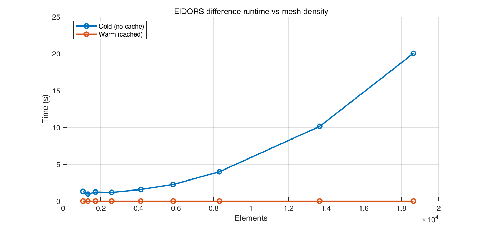

# PyEIDORS

<p align="center">
  
</p>

[](pyproject.toml)


A Python-first EIT framework with a FEniCS Complete Electrode Model (CEM) backend and PyTorch acceleration, designed to be familiar to EIDORS users while enabling modern GPU/differentiable workflows.

SoftwareX manuscript in preparation; citation info will be added after acceptance.

## Why PyEIDORS

- **Numerical Consistency**: Matches EIDORS-style workflows with verified simulation parity.
- **Modern Architecture**: Hybrid FEniCS (FEM) + PyTorch (Inverse/Accel) design.
- **Modular & Extensible**: `EITSystem` coordinator makes it easy to replace geometry, forward models, or solvers.
- **Research Ready**: End-to-end scripts for absolute & difference reconstruction, real-time mesh generation, and benchmarking.

---

## Quick Start

0. **Install Docker (required)**:
   - **Windows**: install WSL2 first, then install Docker Desktop (WSL2 backend).
   - **macOS/Linux**: install Docker Desktop (or Docker Engine on Linux).
   - After installation, open a terminal and verify:
     ```bash
     docker --version
     ```

1. **Download this repository and enter the folder**:
   ```bash
   git clone https://github.com/CBZ199671/PyEIDORS.git
   cd PyEIDORS
   ```
   You can move the `PyEIDORS` folder anywhere you like; just make sure you run commands inside it.

2. **Start the Docker Environment** (this mounts the current folder into the container):
   ```bash
   docker run -ti -v "$(pwd):/root/shared" -w /root/shared --name pyeidors ghcr.io/cbz199671/pyeidors-env:latest
   ```

   If you use a different local path, replace `$(pwd)` with your full folder path. The `-v` flag binds your local repo into `/root/shared` inside the container.

3. **Install the Package**:
   ```bash
   pip install -e .
   ```

4. **Run a Synthetic Demo** (Paper parity example):
   ```bash
   python scripts/run_synthetic_parity.py --output-root results/simulation_parity/run03 --mode both --difference-solver single-step --gn-regularization 1e-11
   ```

5. **Run a Real-Data Demo** (Tank difference imaging):
   ```bash
   python scripts/run_single_step_diff_realdata.py --csv data/measurements/tank/2025-11-14-22-18-02_1_10.00_50uA_3000Hz.csv --background-sigma 0.008 --lambda 0.9
   ```

The repository includes pre-generated demo outputs under `results/` (see the `COMMAND.md` files inside each demo directory).

---

## Gallery & Validation

### Modern Architecture: FEniCS + PyTorch

<p align="center">
  
</p>

### Gauss-Newton Absolute Reconstruction

<p align="center">
  
</p>

*Absolute-mode voltage RMSE reaches **8.23×10⁻⁸ V**, supporting numerical consistency of the underlying FEM implementation and EIDORS-style reconstruction workflow.*

Numerical performance metrics for absolute and difference reconstruction modes:

| Metric | Absolute mode | Difference mode |
|---|---:|---:|
| RMSE (V) | 8.23×10⁻⁸ | 7.68×10⁻⁵ |
| MAE (V) | 5.59×10⁻⁸ | 6.43×10⁻⁵ |
| Max. absolute error (V) | 2.60×10⁻⁷ | 1.47×10⁻⁴ |
| Pearson correlation | >0.9999 | 0.991 |
| Measurements | 208 | 208 |

### Simulation Parity with EIDORS

<p align="center">
  
</p>

Comparison of conductivity reconstructions and voltage predictions between PyEIDORS and MATLAB/EIDORS. (a) Ground-truth. (b) PyEIDORS single-step difference. (c) MATLAB/EIDORS raw. (d) EIDORS (aligned). (e) Differential voltage traces.

*Note: The larger residuals observed in EIDORS' voltage predictions compared to PyEIDORS do not imply superior reconstruction performance by PyEIDORS. This discrepancy arises primarily from numerical implementation differences in forward modeling. Since the synthetic measurement data in this experiment was generated using PyEIDORS' forward model, the PyEIDORS inverse solver benefits from inherent modeling consistency. Conversely, EIDORS incurs inevitable modeling bias when reconstructing from this data due to subtle differences in mesh discretization, finite element interpolation orders, and Complete Electrode Model (CEM) boundary handling.*

### Experimental Validation: Tank Data

<p align="center">
  
</p>

Verification using tank measurement data. PyEIDORS (b, c) demonstrates consistent performance with MATLAB/EIDORS benchmarks (d, e).

Parameter settings for the forward modeling and inverse solution corresponding to the tank comparison panels:

| Category | Parameter | b | c | d | e |
|---|---|---:|---:|---:|---:|
| Fwd. | Background conductivity (S/m) | 0.008 | 0.008 | 0.008 | 0.008 |
| Fwd. | Stimulation amplitude | 1.0 | 5e-5 | 1.0 | 5e-5 |
| Fwd. | Measurement gain | 10 | 10 | 10 | 10 |
| Fwd. | Contact impedance | 1e-6 | 1e-6 | 1e-6 | 1e-6 |
| Fwd. | Mesh radius | 0.025 | 0.025 | 0.025 | 0.025 |
| Fwd. | Number of electrodes | 16 | 16 | 16 | 16 |
| Fwd. | Number of nodes & elements | 1976 & 3806 | 1976 & 3806 | 1122 & 2130 | 1122 & 2130 |
| Inv. | Regularization lambda | 1.5 | 0.9 | 1.5 | 0.9 |
| Inv. | Regularization type | NOSER | NOSER | NOSER | NOSER |

### Experimental Validation: Bio-impedance (Corn Stalk)

<p align="center">
  
</p>

Reconstruction of a corn stalk sample, capturing electrical heterogeneity in biological tissue.

---

## System Architecture

PyEIDORS is designed as a modular pipeline:

```
Mesh Loading/Generation ──► Forward Model (Complete Electrode Model)
                                  │
                                  ▼
                      Jacobian Computation & Regularization
                                  │
                                  ▼
                      Modular Gauss-Newton Reconstruction
                                  │
                                  ▼
            Visualization · Synthetic Data · Result Analysis
```

This architecture is intentionally modular so you can swap meshes, forward models, Jacobian calculators, or priors without rewriting the full pipeline.

Highlights:

- Designed for research and engineering practice, covering the complete pipeline of mesh generation, forward modeling, Jacobian computation, regularization, and Gauss-Newton reconstruction.
- Modular design with `EITSystem` as the core coordinator for geometry, forward, and inverse problem components.
- Supports GMsh+meshio+FEniCS mesh workflow, with built-in stimulation/measurement pattern manager, synthetic data generation, and visualization tools.
- Provides examples, tests, and reports to help verify electrode layouts, mesh quality, and end-to-end reconstruction pipelines.

### Key Components

- **Geometry**: GMsh-based mesh generation (`mesh_generator.py`) and cached loading (`mesh_loader.py`).
- **Forward Model**: Complete Electrode Model (CEM) implemented in FEniCS (`eit_forward_model.py`).
- **Inverse Solver**:
    - Adaptive Gauss-Newton (PyTorch-accelerated).
    - EIDORS-style single-step difference imaging.
    - Sparse Bayesian learning workflows.
- **Visualization**: `EITVisualizer` for meshes, conductivity maps, and measurement error plots.

For a file-level map of the codebase, see `FILE_ORGANIZATION.md`.

---

## Performance Benchmarks

End-to-end **single-step difference reconstruction** timing (Warm Start).
PyEIDORS' **measurement-space solve** ($J R^{-1} J^T$) significantly outperforms the standard parameter-space solve ($J^T J$) on dense meshes.

<p align="center">
  
</p>
<p align="center">
  
</p>

For reference, we include the EIDORS timing curve (cold vs cached). EIDORS caching is extremely strong; the cold (no cache) curve is the fairer comparison point. PyEIDORS caching is currently limited and does not yet match EIDORS' cache behavior.

<p align="center">
  
</p>

Bench scripts:
- PyEIDORS: `python scripts/benchmarks/benchmark_difference_runtime.py`
- EIDORS: `compare_with_Eidors/benchmark_jacobian_runtime.m` (set `benchmark_mode = 'difference'`)

| Elements | Baseline (s) | Measurement-Space (s) | Speedup |
|---:|---:|---:|---:|
| 2,650 | 1.873 | 1.336 | **1.40×** |
| 5,702 | 5.848 | 2.356 | **2.48×** |
| 10,584 | 20.722 | 4.003 | **5.18×** |
| 14,650 | 46.465 | 5.313 | **8.74×** |
| 18,474 | 85.128 | 7.082 | **12.02×** |

---

## Advanced Usage

### 1. Synthetic Simulation Comparison
Automatically generate simulation data and compute error statistics vs. EIDORS:

```bash
python scripts/run_synthetic_parity.py \
  --output-root results/simulation_parity/run01 \
  --mode both --save-forward-csv \
  --difference-solver single-step \
  --eidors-csv path/to/eidors_voltages.csv
```

The script will:

- Run forward simulation with given circular phantom parameters, saving baseline/anomaly boundary voltages.
- Execute absolute and difference imaging reconstruction sequentially, outputting residuals, RMSE, correlation coefficients, and other metrics (`metrics.json`).
- Optionally load EIDORS-generated voltage vectors via `--eidors-csv` to automatically compute differences with PyEIDORS.

### 2. Real Measurement Data
After data normalization (see `docs/MEASUREMENT_DATA_SPEC.md`), run reconstruction:

```bash
python scripts/run_real_measurement_reconstruction.py \
  --csv data/measurements/sample.csv \
  --metadata data/measurements/sample.yaml \
  --use-cols 0 2
```

The script validates the measurement matrix, builds `EITSystem`, and performs difference inverse problem reconstruction. Output measurement curves and conductivity images are saved in `results/real_measurements/`.

### 3. Sparse Bayesian Learning
Run the advanced sparse Bayesian solver (supports GPU):

```bash
python scripts/run_sparse_bayesian_reconstruction.py \
  --csv data/measurements/sample.csv \
  --mode both --solver fista --use-gpu
```

The repository also includes a pre-generated tank sparse Bayesian demo under:
`results/tank_final_results/sparse_bayesian_physical_bg0008_v1_0/` (see `COMMAND.md` inside).

Results are written to `results/sparse_bayesian/` by default. For a full list of options, run `python scripts/run_sparse_bayesian_reconstruction.py --help`.

## Data, Visualization, and Testing

- Synthetic data: `create_synthetic_data` supports setting noise level, anomaly position and conductivity, returning clean/noisy data with SNR metrics.
- Real measurement data: `MeasurementDataset` helper class builds `EITData` from normalized measurement matrices and metadata, see `docs/MEASUREMENT_DATA_SPEC.md`.
- Visualization: `EITVisualizer` includes built-in plotting for mesh, conductivity, measurements, reconstruction comparison, and convergence curves, with PNG report output.
- Testing: `tests/unit/test_complete_eit_system.py` provides end-to-end pipeline validation, `tests/unit/test_optimized_mesh_generator.py` covers geometry and electrode layout.
- Examples: `examples/basic_usage.py` demonstrates module structure, environment checking, and system initialization steps.

---

## Documentation

- **File Structure**: `FILE_ORGANIZATION.md`
- **Data Specs**: `docs/MEASUREMENT_DATA_SPEC.md`
- **Electrode Setup**: `docs/ELECTRODE_Y_AXIS_POSITIONING.md`
- **Docker Notes**: `docs/DOCKER.md`

## Docker Environment Setup

The recommended workflow is to use the prebuilt Docker image. It already contains FEniCS, CUQIpy, and PyTorch. See `docs/DOCKER.md` for the most up-to-date commands.

### Option A: Prebuilt Image (Recommended)

```bash
docker pull ghcr.io/cbz199671/pyeidors-env:latest

docker run -ti \
  -v "$(pwd):/root/shared" \
  -w /root/shared \
  --name pyeidors \
  ghcr.io/cbz199671/pyeidors-env:latest
```
*Note: Add `--gpus all` for GPU support.*

Notes:

- The `-v ...:/root/shared` path should point to your local clone of this repository.
- On Windows, install WSL2 + Docker Desktop (WSL2 backend) first; see `docs/DOCKER.md`.
- For GPU support, add `--gpus all` (requires NVIDIA Container Toolkit).
- Do not set `--cpus` / `--memory` unless you want to limit Docker. By default, Docker can use the available host resources.
- If you hit shared-memory issues (e.g., `/dev/shm` errors), add `--shm-size=2g` (or larger). On Linux, `--ipc=host` can also help.
- If you downloaded an offline image archive (e.g., `pyeidors-ultra22.tar.zst`), see `docs/DOCKER.md` for `docker load` instructions.

### Option B: Manual Build

```bash
# Start container
docker run -ti \
  -v "$(pwd):/root/shared" \
  -w /root/shared \
  --name pyeidors \
  ghcr.io/scientificcomputing/fenics-gmsh:2024-05-30

# (Optional) Install CJK font dependencies
apt-get update && apt-get install -y fonts-wqy-zenhei

# Install CUQIpy and CUQIpy-FEniCS
pip install cuqipy cuqipy-fenics

# Create virtual environment
python3 -m venv /opt/final_venv --system-site-packages
source /opt/final_venv/bin/activate

# Install PyTorch
pip3 install torch torchvision torchaudio --index-url https://download.pytorch.org/whl/cu128
```

## Environment Components
- **FEniCS**: 2024-05-30 (Official Image)
- **CUQIpy**: 1.3.0
- **CUQIpy-FEniCS**: 0.8.0
- **PyTorch**: 2.7.1+cu128
- **Python**: 3.10+
