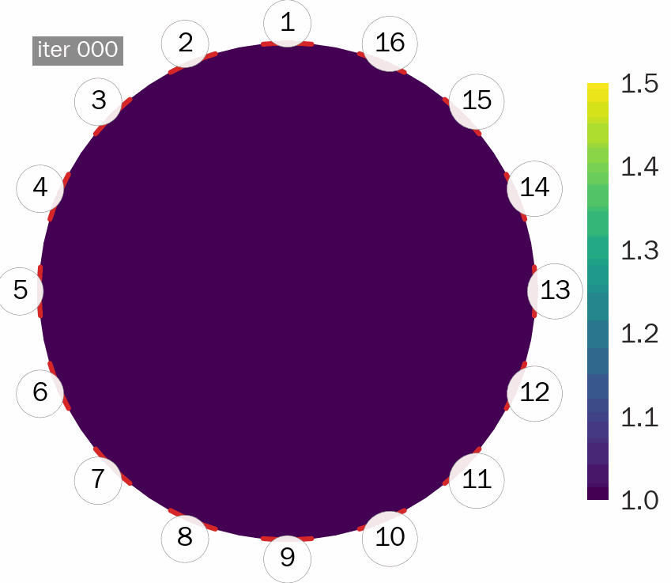
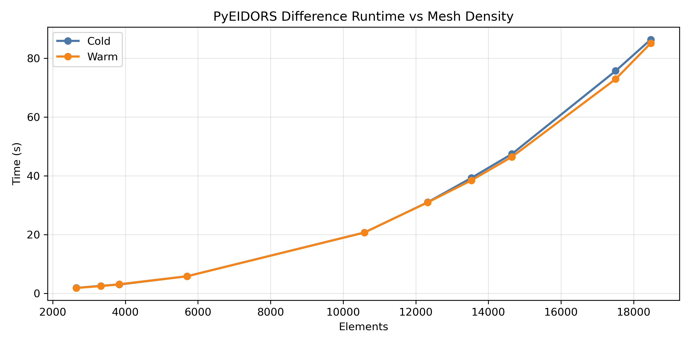
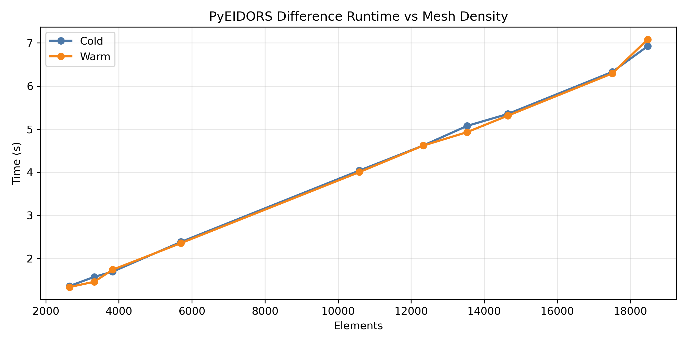
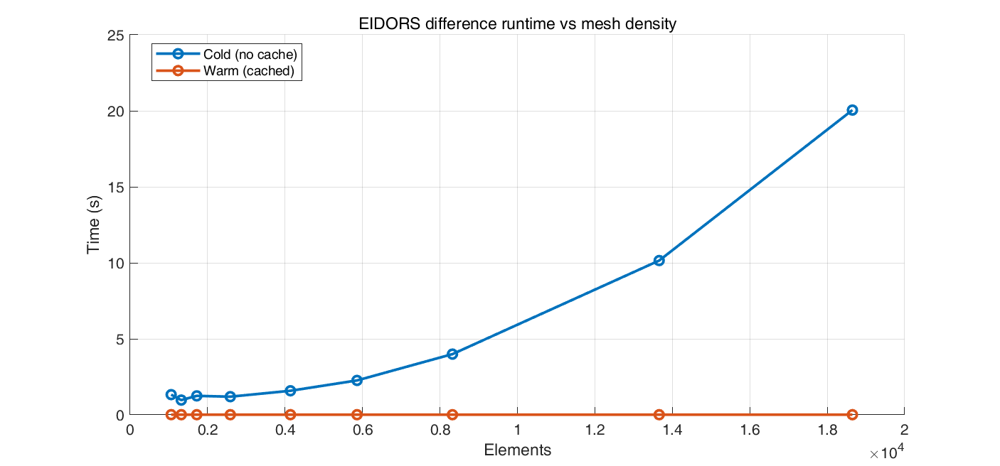

# PyEIDORS

<p align="center">
  
</p>

[](pyproject.toml)

-orange)


A Python-first EIT framework with a FEniCSx (DOLFINx) Complete Electrode Model (CEM) backend and PyTorch acceleration, designed to be familiar to EIDORS users while enabling modern GPU/differentiable workflows.

SoftwareX manuscript in preparation; citation info will be added after acceptance.

## Why PyEIDORS

- **Numerical Consistency**: Matches EIDORS-style workflows with verified simulation parity.
- **Modern Architecture**: Hybrid FEniCSx (FEM) + PyTorch (Inverse/Accel) design.
- **Modular & Extensible**: `EITSystem` coordinator makes it easy to replace geometry, forward models, or solvers.
- **Research Ready**: End-to-end scripts for absolute & difference reconstruction, real-time mesh generation, and benchmarking.

---

## Quick Start

PyEIDORS uses **pure Nix** as the primary development and distribution path for FEniCSx:

```bash
git clone https://github.com/CBZ199671/PyEIDORS.git
cd PyEIDORS
nix develop .#complex64-cuda
python scripts/env/verify_env_manifest.py
python -c "import dolfinx, torch, cuqi, pyeidors, pyqtgraph; from PySide6.QtCore import Qt"
```

WSL2 note: treat `nix develop` as the bootstrap step.
In a fresh WSL2 shell, do not use `.venv/bin/python` or `uv run` as the default
runtime. Re-enter the repository with `nix develop .#complex64-cuda` and retry.

For the opt-in CUDA path on WSL2/NVIDIA, use `nix develop .#cuda`, verify the
runtime with `python scripts/diagnostics/probe_petsc_cuda.py --require cuda --pretty`,
and then enable FEM GPU routing with `--petsc-device auto|cuda`; for full GN CUDA runs also set inverse runtime `--device auto|cuda`.

For the GUI, use the repository launcher instead of ad-hoc `PYTHONPATH=src ...`
commands. This launcher preserves the nix runtime paths, adds both repository
root and `src/`, and performs a preflight check before opening the window:

```bash
./eit-gui --cpu
./eit-gui --gpu
```

The longer `bash scripts/gui/run_eit_app.sh --gpu` form is still supported for
automation and debugging.

On the Windows host side, use:

```powershell
powershell -ExecutionPolicy Bypass -File .\scripts\gui\run_eit_app.ps1 -Profile cpu
powershell -ExecutionPolicy Bypass -File .\scripts\gui\run_eit_app.ps1 -Profile gpu
```

For one-click launch from Explorer, double-click the repository-root wrappers:

```text
EIT-GUI-CPU.cmd
EIT-GUI-GPU.cmd
```

The `--gpu` route enters `nix develop .#cuda` automatically and runs the CUDA
PETSc probe before launching the GUI. Use `--skip-cuda-probe` only when you are
already sure the GPU shell is healthy.

Then run a quick workflow check:

```bash
python scripts/run_synthetic_parity.py --output-root results/simulation_parity/run03 --mode both --difference-solver single-step --gn-regularization 1e-11
```

Strict CEM smoke (default includes inverse reconstruction and fails fast on numerical errors):

```bash
python scripts/run_cem_16e_square_test.py
```

Forward-only diagnostics (skip inverse explicitly):

```bash
python scripts/run_cem_16e_square_test.py --skip-inverse
```

3D CEM smoke (cylindrical, one-ring 16 electrodes):

```bash
python scripts/run_cem_16e_cylinder_3d_test.py
python scripts/run_cem_16e_cylinder_3d_test.py --skip-inverse
```

For full setup, validation, and troubleshooting, see `docs/NIX_FENICSX.md`.

Docker is no longer a maintained setup path; see `docs/DOCKER.md` for status.

> Hard-cut note: the runtime is now **FEniCSx-only** in `src/pyeidors/**`. DOLFIN aliases are removed.

### Phase-2 API Notes (Breaking)

- `EITSystem.setup()` no longer auto-falls back from cache loading to generation.
- Use explicit setup paths:
  - `system.setup(mesh=eit_mesh)`
  - `system.setup(mesh_source="cache", mesh_dir="eit_meshes", mesh_name="mesh_...")`
  - `system.setup(mesh_source="generated", radius=1.0, mesh_size=0.1)`
- Mesh caches now prefer DOLFINx-native XDMF/HDF5 reuse: `.msh` is imported
  once, then `<mesh>.xdmf`, `<mesh>.h5`, and `<mesh>_dolfinx_cache.json` are
  used for repeat loads. Set `PYEIDORS_WRITE_ADIOS2_MESH_CACHE=1` only when you
  also want an optional ADIOS2/VTX `.bp` output artifact.
- For very large checkpoint/restart experiments, an optional third-party
  `adios4dolfinx` checkpoint can be emitted with
  `PYEIDORS_WRITE_ADIOS4DOLFINX_CHECKPOINT=1`; it is not part of the default GUI
  reload path.
- Solver APIs now return typed `SolverOutput` objects (not ad-hoc dictionaries).
- `EITSystem` now exposes cache controls for repeat runs:
  - `cache_scope`: `"off" | "process" | "disk" | "both"` (default `"both"`)
  - `cache_dir`: disk cache root (default `.pyeidors_cache/v2`)
  - `system.get_cache_stats()` / `system.clear_cache(scope="both")`
- Forward backend defaults to PETSc (`linear_backend="petsc"`), with SciPy fallback (`"scipy"`).
- `performance_mode` now supports `"aggressive"` (default) and `"safe"`.

### Plot Language & Font Control

- Default plotting language is English (`en`) for cross-platform stability.
- Switch language at runtime:
  - Constructor argument: `EITVisualizer(language="zh")`
  - Environment variable: `PYEIDORS_PLOT_LANG=zh` (`en|zh|auto`)
- Priority: explicit constructor argument > `PYEIDORS_PLOT_LANG` > default `en`.
- In Chinese mode, if no Chinese-capable font exists on the machine, PyEIDORS falls back to English-safe fonts automatically (single warning, no warning spam).

---

## Gallery & Validation

### Modern Architecture: FEniCSx + PyTorch

<p align="center">
  
</p>

### Gauss-Newton Absolute Reconstruction

<p align="center">
  
</p>

*Absolute-mode voltage RMSE reaches **8.23×10⁻⁸ V**, supporting numerical consistency of the underlying FEM implementation and EIDORS-style reconstruction workflow.*

Numerical performance metrics for absolute and difference reconstruction modes:

| Metric | Absolute mode | Difference mode |
|---|---:|---:|
| RMSE (V) | 8.23×10⁻⁸ | 7.68×10⁻⁵ |
| MAE (V) | 5.59×10⁻⁸ | 6.43×10⁻⁵ |
| Max. absolute error (V) | 2.60×10⁻⁷ | 1.47×10⁻⁴ |
| Pearson correlation | >0.9999 | 0.991 |
| Measurements | 208 | 208 |

### Simulation Parity with EIDORS

<p align="center">
  
</p>

Comparison of conductivity reconstructions and voltage predictions between PyEIDORS and MATLAB/EIDORS. (a) Ground-truth. (b) PyEIDORS single-step difference. (c) MATLAB/EIDORS raw. (d) EIDORS (aligned). (e) Differential voltage traces.

*Note: The larger residuals observed in EIDORS' voltage predictions compared to PyEIDORS do not imply superior reconstruction performance by PyEIDORS. This discrepancy arises primarily from numerical implementation differences in forward modeling. Since the synthetic measurement data in this experiment was generated using PyEIDORS' forward model, the PyEIDORS inverse solver benefits from inherent modeling consistency. Conversely, EIDORS incurs inevitable modeling bias when reconstructing from this data due to subtle differences in mesh discretization, finite element interpolation orders, and Complete Electrode Model (CEM) boundary handling.*

### Experimental Validation: Tank Data

<p align="center">
  
</p>

Verification using tank measurement data. PyEIDORS (b, c) demonstrates consistent performance with MATLAB/EIDORS benchmarks (d, e). Panels (f, g) show the original EIDORS reconstructions before affine alignment.

Parameter settings for the forward modeling and inverse solution corresponding to the tank comparison panels:

| Category | Parameter | b | c | d | e |
|---|---|---:|---:|---:|---:|
| Fwd. | Background conductivity (S/m) | 0.008 | 0.008 | 0.008 | 0.008 |
| Fwd. | Drive mode / value | normalized / 1.0 | line current density / 5e-5 A/m | normalized / 1.0 | line current density / 5e-5 A/m |
| Fwd. | Measurement gain | 10 | 10 | 10 | 10 |
| Fwd. | Contact impedance | 1e-6 | 1e-6 | 1e-6 | 1e-6 |
| Fwd. | Mesh radius | 0.025 | 0.025 | 0.025 | 0.025 |
| Fwd. | Number of electrodes | 16 | 16 | 16 | 16 |
| Fwd. | Number of nodes & elements | 1976 & 3806 | 1976 & 3806 | 1122 & 2130 | 1122 & 2130 |
| Inv. | Regularization lambda | 1.5 | 0.9 | 1.5 | 0.9 |
| Inv. | Regularization type | NOSER | NOSER | NOSER | NOSER |

### Experimental Validation: Bio-impedance (Corn Stalk)

<p align="center">
  
</p>

Reconstruction of a corn stalk sample, capturing electrical heterogeneity in biological tissue.

---

## System Architecture

PyEIDORS is designed as a modular pipeline:

```
Mesh Loading/Generation ──► Forward Model (Complete Electrode Model)
                                  │
                                  ▼
                      Jacobian Computation & Regularization
                                  │
                                  ▼
                      Modular Gauss-Newton Reconstruction
                                  │
                                  ▼
            Visualization · Synthetic Data · Result Analysis
```

This architecture is intentionally modular so you can swap meshes, forward models, Jacobian calculators, or priors without rewriting the full pipeline.

Highlights:

- Designed for research and engineering practice, covering the complete pipeline of mesh generation, forward modeling, Jacobian computation, regularization, and Gauss-Newton reconstruction.
- Modular design with `EITSystem` as the core coordinator for geometry, forward, and inverse problem components.
- Supports Gmsh + DOLFINx native mesh workflow, with built-in stimulation/measurement pattern manager, synthetic data generation, and visualization tools.
- Provides examples, tests, and reports to help verify electrode layouts, mesh quality, and end-to-end reconstruction pipelines.

### Current Drive Semantics

PyEIDORS now uses explicit drive semantics instead of a single ambiguous amplitude scalar:

- `drive_mode="line_current_density"`: `drive_value` is in `A/m` (recommended for 2D physical modeling).
- `drive_mode="total_current"`: `drive_value` is in `A`.
- `drive_mode="normalized"`: dimensionless drive for algorithmic comparisons.

In `line_current_density` mode, physical electrode length is computed from mesh boundary integration and `geometry_scale_to_m`, with optional explicit override via `electrode_length_m_override`.

Current drive semantics and metadata fields are defined in `docs/MEASUREMENT_DATA_SPEC.md`.

### Key Components

- **Geometry**: GMsh-based mesh generation (`mesh_generator.py`) and cached loading (`mesh_loader.py`).
- **Forward Model**: Complete Electrode Model (CEM) implemented in FEniCSx (`eit_forward_model.py`).
- **Inverse Solver**:
    - Adaptive Gauss-Newton (PyTorch-accelerated).
    - EIDORS-style single-step difference imaging.
    - Sparse Bayesian learning workflows.
- **Visualization**: `EITVisualizer` for meshes, conductivity maps, and measurement error plots.

For a file-level map of the codebase, see `FILE_ORGANIZATION.md`.

---

## Performance Benchmarks

End-to-end **single-step difference reconstruction** timing (Warm Start).
PyEIDORS' **measurement-space solve** is derived via Woodbury to avoid forming the large n&times;n system (n = mesh elements). The standard form solves
(J<sup>T</sup>J + &lambda;R) &delta; = J<sup>T</sup>d (parameter space), while the measurement-space form solves
(J R<sup>-1</sup> J<sup>T</sup> + &lambda;I) y = d and then &delta; = R<sup>-1</sup> J<sup>T</sup> y.
Here m = number of measurements, so the inner solve is m&times;m (typically 208), which is much smaller than n&times;n for dense meshes. With NOSER, R is diagonal, so R<sup>-1</sup> is just elementwise inversion, keeping the solution algebraically equivalent but far cheaper in memory and runtime.

<p align="center">
  
</p>
<p align="center">
  
</p>

For reference, we include the EIDORS timing curve (cold vs cached). EIDORS caching is extremely strong; the cold (no cache) curve is the fairer comparison point. PyEIDORS now includes EIDORS-style semantic caching for Jacobian and GN one-step operator families (`J/Jᵀ/NOSER/A/LU`, process + disk), so repeated difference reconstructions on an unchanged background can reuse heavy kernels across runs.

<p align="center">
  
</p>

Bench scripts:
- PyEIDORS: `python scripts/benchmarks/benchmark_difference_runtime.py`
- EIDORS: `compare_with_Eidors/benchmark_jacobian_runtime.m` (set `benchmark_mode = 'difference'`)
- Pipeline profiler (time + peak memory by stage): `python scripts/benchmarks/profile_reconstruction_pipeline.py`

Accuracy check (parameter-space vs measurement-space, refinement=12):
- `delta_rel=8.66e-09`, `rmse_param=4.503e-01`, `rmse_meas=4.503e-01`, `pred_rel=5.10e-10`
- Reproduce with: `python scripts/benchmarks/benchmark_difference_runtime.py --refinements 12 --compare-solvers --single-step-space measurement`
- Optional memory stats for difference benchmark CSV: add `--memory-stats`.

CI perf gating compares:
- baseline profile: parameter-space / iterative options
- optimized profile: measurement-space / single-step options
- thresholds: median improvement `>=10%`, worst-case regression `<=5%`

Phase-2 hard refactor upgrades this gate to:
- median improvement `>=50%` (equivalent to median speedup `>=2x`)
- worst-case regression `<=5%`

Cache architecture and tuning guide:
- `docs/CACHE_ARCHITECTURE.md`
- cache CLI utility:
  - `python scripts/cache/cache_ctl.py status`
  - `python scripts/cache/cache_ctl.py status --name calc_jacobian --name inv_solve_diff_GN_one_step`
  - `python scripts/cache/cache_ctl.py off --name calc_jacobian`
  - `python scripts/cache/cache_ctl.py on --name calc_jacobian`
  - `python scripts/cache/cache_ctl.py clear-old --timestamp <epoch-seconds>`
  - `python scripts/cache/cache_ctl.py clear-new --timestamp <epoch-seconds>`
  - `python scripts/cache/cache_ctl.py clear-name --name inv_solve_diff_GN_one_step`
  - `python scripts/cache/cache_ctl.py collect-recent --name inv_solve_diff_GN_one_step --with-values --output cache_snapshot.json`
  - `python scripts/cache/cache_ctl.py install-to-cache --input cache_snapshot.json --target-layers both`

Expected warm/cold behavior for GN difference:
- first run on a new background is cold and computes `jacobian + operator family`.
- later runs with unchanged background conductivity should hit cache at process/disk layer.
- if `sigma_hash`, mesh signature, stimulation pattern, backend config, or cache schema changes, entries are invalidated and recomputed.

| Elements | Baseline (s) | Measurement-Space (s) | Speedup |
|---:|---:|---:|---:|
| 2,650 | 1.873 | 1.336 | **1.40×** |
| 5,702 | 5.848 | 2.356 | **2.48×** |
| 10,584 | 20.722 | 4.003 | **5.18×** |
| 14,650 | 46.465 | 5.313 | **8.74×** |
| 18,474 | 85.128 | 7.082 | **12.02×** |

---

## Advanced Usage

### 1. Synthetic Simulation Comparison
Automatically generate simulation data and compute error statistics vs. EIDORS:

```bash
python scripts/run_synthetic_parity.py \
  --output-root results/simulation_parity/run01 \
  --mode both --save-forward-csv \
  --difference-solver single-step \
  --eidors-csv path/to/eidors_voltages.csv
```

The script will:

- Run forward simulation with given circular phantom parameters, saving baseline/anomaly boundary voltages.
- Execute absolute and difference imaging reconstruction sequentially, outputting residuals, RMSE, correlation coefficients, and other metrics (`metrics.json`).
- Optionally load EIDORS-generated voltage vectors via `--eidors-csv` to automatically compute differences with PyEIDORS.

### 2. Real Measurement Data
After data normalization (see `docs/MEASUREMENT_DATA_SPEC.md`), run reconstruction:

```bash
python scripts/run_reconstruction_unified.py \
  --method gn-difference \
  --input-mode paired \
  --csv data/measurements/sample.csv \
  --metadata data/measurements/sample.yaml \
  --reference-col 0 \
  --target-col 2 \
  --cache-scope both \
  --cache-dir .pyeidors_cache/v2 \
  --output-root results/real_measurements
```

The script validates the measurement matrix, builds `EITSystem`, and performs difference inverse problem reconstruction. With unchanged background conductivity, Jacobian and single-step operator are reused from cache on later runs. Output measurement curves and conductivity images are saved in `results/real_measurements/`.
By default, disk cache now uses a terminal-scoped session lifecycle in supported `nix develop` / `nix develop .#cuda` shells: repeated runs in the same shell reuse `.pyeidors_cache/v2/.sessions/<session-id>`, and that shell-owned cache is cleared automatically on shell exit or `deactivate`. Use `cache_lifecycle="persistent"` only when you explicitly want cross-terminal reuse.

3D reconstruction uses the same unified CLI and supports `gn-difference` and `gn-absolute`.
For 3D, `--solver-mode` defaults to `fast` (with `strict` as fallback):

```bash
python scripts/run_reconstruction_unified.py \
  --method gn-difference \
  --input-mode paired \
  --csv data/measurements/sample.csv \
  --output-root results/real_measurements_3d \
  --mesh-dim 3 \
  --radius 0.25 \
  --mesh-height 0.2 \
  --refinement 3 \
  --solver-mode fast \
  --linear-solver auto \
  --jacobian-update-every 2 \
  --jacobian-reuse-tol 1e-3 \
  --line-search-mode fast \
  --cache-scope both
```

To force strict parity mode for diagnostics:

```bash
python scripts/run_reconstruction_unified.py \
  --method gn-absolute \
  --input-mode paired \
  --csv data/measurements/sample.csv \
  --metadata data/measurements/sample.yaml \
  --reference-col 0 \
  --target-col 2 \
  --mesh-dim 3 \
  --solver-mode strict \
  --line-search-mode full \
  --output-root results/real_measurements_3d_strict
```

`solver_mode="strict"` still means the reference solve path. On 3D `gn-difference` with the current NOSER diagonal regularization, the implementation keeps the original dense parameter-space backend (`dense-param`) for 2D, small 3D, and any case that stays within the strict memory guard. Only when the estimated dense strict system would exceed the 3D memory guard does it switch internally to the algebraically equivalent low-memory backend `measurement-exact`. This is not a fast fallback and not an approximate iterative strict mode.

When you validate strict behavior through `scripts/benchmarks/benchmark_3d_runtime.py`, inspect `difference_solver.strict_solver_backend_effective`, `difference_solver.strict_memory_guard_triggered`, and `difference_solver.strict_measurement_system_shape` in the JSON report. `measurement-exact` means strict stayed exact while avoiding the dense `JᵀJ + λ diag(R)` allocation; `dense-param` means the original parameter-space strict path was retained.

### 3. Sparse Bayesian Learning
Run the advanced sparse Bayesian solver (supports GPU):

```bash
python scripts/run_reconstruction_unified.py \
  --method sparse-bayes \
  --input-mode paired \
  --csv data/measurements/sample.csv \
  --metadata data/measurements/sample.yaml \
  --reference-col 0 \
  --target-col 2 \
  --solver fista --use-gpu \
  --output-root results/sparse_bayesian
```

The repository also includes a pre-generated tank sparse Bayesian demo under:
`results/tank_final_results/sparse_bayesian_physical_bg0008_v1_0/` (see `COMMAND.md` inside).

Results are written under `results/sparse_bayesian/<method>/<case>/`. For a full list of options, run `python scripts/run_reconstruction_unified.py --help`.

### 4. 3D Performance Benchmark + Gate

`D_combined` is the current recommended 3D fast profile for end-to-end runtime.
It combines the low-risk optimizations that consistently helped total time or protected it from regression:

- `fast_linear_path=auto`, which resolves to `woodbury` for diagonal regularization.
- `jacobian_block_tune=auto`, which stabilizes Jacobian assembly cost on larger 3D meshes.
- `preconditioner=auto`, which still allows `cholmod-precond` / `pcg` fallback where useful.

`E_fused` (`rom/inexact/lowrank`) remains available, but it is now treated as experimental:

- It can reduce inner-stage costs, especially Jacobian assembly.
- It does not currently deliver stable end-to-end wins on the benchmark workloads.
- Fallback order remains `fused -> current fast path (woodbury/pcg/cholmod-precond) -> strict`.

Quick validation and full fair-compare are now interpreted against `D_combined` as the main delivery path:

- `quick`: compares `A_baseline` vs `D_combined` to decide whether the full run is worth doing.
- `full`: keeps `A/B/C/D/E`, but strict gate focuses on `B/C/D`; `E_fused` is informational/experimental.
- `check_perf_gate.py` should be read stage-by-stage: if `D_combined` passes total/peak/Jacobian checks, the main 3D fast path is healthy even if `E_fused` remains mixed.

```bash
python scripts/benchmarks/benchmark_3d_runtime.py \
  --solver-mode fast \
  --linear-solver auto \
  --perf-report reports/perf/latest.json

python scripts/benchmarks/check_perf_gate.py \
  --input reports/perf/latest.json \
  --mode warn

python scripts/benchmarks/benchmark_3d_runtime.py \
  --solver-mode strict \
  --repeat 1 \
  --perf-report reports/perf/latest_strict.json

python scripts/benchmarks/benchmark_3d_fair_compare.py \
  --benchmark-phase quick \
  --output-json reports/perf/fair_compare_latest.json \
  --output-md reports/perf/fair_compare_latest.md

python scripts/benchmarks/benchmark_3d_fair_compare.py \
  --benchmark-phase full \
  --output-json reports/perf/fair_compare_latest.json \
  --output-md reports/perf/fair_compare_latest.md
```

For CPU strict reports on the current WSL2 machine, read the difference-side diagnostics before assuming the backend changed semantics. If `difference_solver.strict_solver_backend_effective == "measurement-exact"` and `difference_solver.strict_memory_guard_triggered == true`, the 3D difference reference solve hit the dense-memory guard and switched to the exact measurement-space strict backend. If it remains `dense-param`, the original dense strict backend was used. `absolute` strict is unchanged by this fallback and should continue to be interpreted through the usual strict diagnostics, not as a fast-path downgrade.

Latest local fair-compare summary (`2026-03-06`, Apple Silicon, single-thread BLAS/OMP):

- `quick`: `A_baseline -> D_combined` passed by the linear-stage criterion (`absolute_linear` improved from about `0.155s` to `0.021s`) while total time stayed roughly flat (`16.35s -> 16.42s`).
- `full ref=1`: `D_combined` uses `woodbury-diag`; `absolute_linear_speedup_x ~= 9.95`, `absolute_jacobian_assembly_speedup_x ~= 1.77`, `absolute_total_speedup_x ~= 0.997`.
- `full ref=2`: `D_combined` uses `woodbury-diag`; `absolute_linear_speedup_x ~= 11.58`, `absolute_jacobian_assembly_speedup_x ~= 1.79`, `absolute_total_speedup_x ~= 1.017`.
- `E_fused` is retained as experimental: it still shows useful stage-level gains, but only mixed end-to-end totals on the same workloads.

For the current CPU封版 rationale and the historical migration blueprint, see `docs/WSL2_CUDA_HANDOFF.md`.
For the active CUDA shell / probe / benchmark workflow, see `docs/WSL2_CUDA.md`.

## Data, Visualization, and Testing

- Synthetic data: `create_synthetic_data` supports setting noise level, anomaly position and conductivity, returning clean/noisy data with SNR metrics.
- Real measurement data: `MeasurementDataset` helper class builds `EITData` from normalized measurement matrices and metadata, see `docs/MEASUREMENT_DATA_SPEC.md`.
  - `to_eit_data()` now defaults to read-only shared views (`copy_policy="view"`) to reduce memory copies; use `copy_policy="copy"` when writable arrays are required.
- Visualization: `EITVisualizer` includes built-in plotting for mesh, conductivity, measurements, reconstruction comparison, and convergence curves, with PNG report output.
- Testing: `tests/unit/test_complete_eit_system.py` provides end-to-end pipeline validation, `tests/unit/test_optimized_mesh_generator.py` covers geometry and electrode layout.
- Examples: `examples/basic_usage.py` demonstrates module structure, environment checking, and system initialization steps.

---

## Documentation

- **File Structure**: `FILE_ORGANIZATION.md`
- **Branching Policy**: `docs/BRANCHING_POLICY.md`
- **Nix (FEniCSx) Setup**: `docs/NIX_FENICSX.md`
- **WSL2 CUDA Workflow**: `docs/WSL2_CUDA.md`
- **Data Specs**: `docs/MEASUREMENT_DATA_SPEC.md`
- **Electrode Setup**: `docs/ELECTRODE_Y_AXIS_POSITIONING.md`
- **Docker Status**: `docs/DOCKER.md`

## Environment Note

The primary maintained developer workflow is **pure Nix** with FEniCSx (DOLFINx), documented in `docs/NIX_FENICSX.md`.
On WSL2, the locked Linux manifest may record `platform.runtime_context.kind = wsl2`
as informational provenance; this documents the shell context that produced the
manifest and is not a separate verification gate.
Optional uv-based performance extras are a legacy/local maintenance path and are
not part of the default user runtime. Use them only when explicitly working on
that route:

```bash
PYEIDORS_ENABLE_UV_SYNC=1 \
ENABLE_PERFORMANCE_EXTRAS=1 scripts/env/sync_locked_env.sh --repair
```

Docker content from the old runtime has been removed; use the locked Nix environment for reproducibility.

### Locked Environment Contract (1:1 Repro)

PyEIDORS now ships a locked Nix environment contract:

- Nix layer: `flake.nix` + `flake.lock` pin the Python interpreter and runtime package closure, including DOLFINx/FEniCSx, Torch, CUQI, Qt/PySide6, and pyqtgraph.
- Manifest layer: `env/manifests/<platform>-<profile>.lock.json` records the active Nix profile, lock hashes, Python version, and required package versions.

Entering `nix develop` automatically does:

1. Select the Nix-provided Python/runtime packages for the chosen profile.
2. Set `PYEIDORS_ACTIVE_ENV=nix` and add repository `src/` to `PYTHONPATH`.
3. Leave `VIRTUAL_ENV` unset so no `.venv*` shadows the Nix profile.
4. Import-check `dolfinx, torch, cuqi, numpy, scipy, pyeidors, pyqtgraph, PySide6`.

Manual commands:

```bash
python scripts/env/verify_env_manifest.py
python scripts/env/export_env_manifest.py --output env/manifests/linux-x86_64-complex64-cuda.lock.json
```

Platform lock manifests:

- `env/manifests/macos-aarch64.lock.json`
- `env/manifests/linux-x86_64.lock.json`
- `env/manifests/linux-x86_64-complex64-cuda.lock.json`
